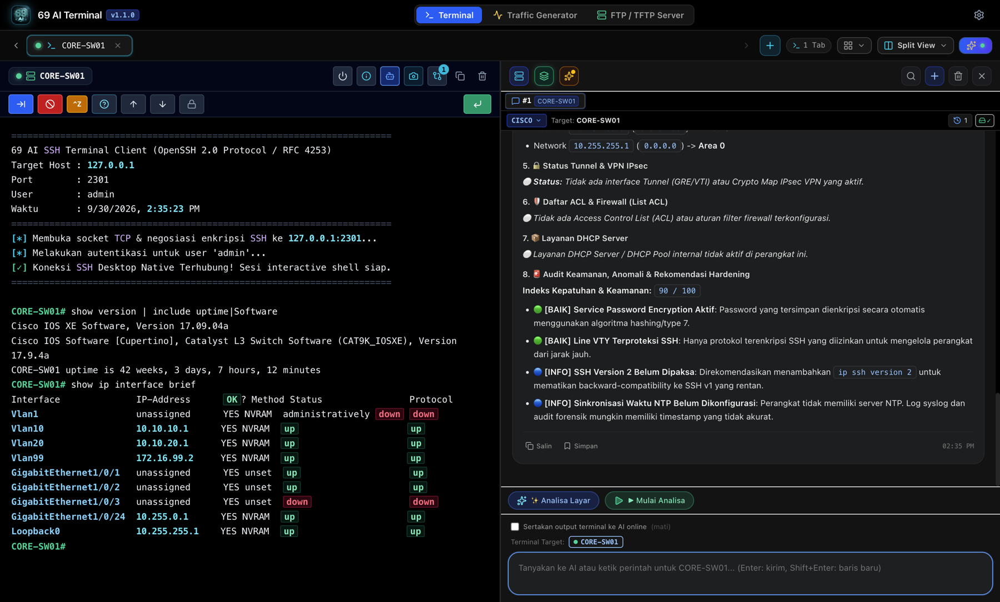

<div align="center">


# 69 AI Network Console

**SSH, serial & Bluetooth console for network engineers, with an AI co-pilot that speaks Cisco, Juniper, MikroTik, Fortinet, Huawei and Linux.**

[](https://github.com/ikhsan-hdytllh/69ai-network-console/releases)
[](LICENSE)
[-lightgrey)](#download)
[](https://www.electronjs.org/)
[](https://github.com/ikhsan-hdytllh/69ai-network-console/actions/workflows/ci.yml)

<p>
  <a href="https://github.com/ikhsan-hdytllh/69ai-network-console/releases/download/v1.1.0/69-AI-Network-Console-1.1.0-arm64.dmg"></a>
  <a href="https://github.com/ikhsan-hdytllh/69ai-network-console/releases/download/v1.1.0/69-AI-Network-Console-1.1.0-x64.dmg"></a>
</p>

[Download](#download) · [Features](#features) · [Security](#security--privacy) · [Build from source](#build-from-source) · [Bahasa Indonesia](README.id.md)



</div>

---

## Why?

Working on network gear usually means juggling a terminal app, a serial console tool, a Bluetooth adapter utility, vendor docs in the browser and an AI chat tab. **69 AI Network Console puts them in one window**: open a session to a switch, run a command, and ask the co-pilot what the output means or what to type next, in the right syntax for that vendor.

## Features

- 🖥️ **Multi-tab SSH terminal** with split view, per-device tabs and colour-highlighted output (`up`/`down`, IPs, errors).
- 🔌 **Serial console over USB** (CP210x, CH340, FTDI, PL2303) with a port picker and baud-rate selection.
- 📶 **Bluetooth console** via BLE UART adapters such as the IRXON BT578.
- 🤖 **AI co-pilot** (bring your own key): Google Gemini, OpenAI, Anthropic Claude or DeepSeek. It answers in the CLI syntax of the target vendor, and every command in an answer has an **Execute** button.
- 📚 **Offline command knowledge base**, so you still get CLI guidance with no internet or no API key.
- 🧰 **Toolbox:** ping and TCP port probe, traffic generator, FTP/TFTP server, config snapshots and diff.
- 🔐 **Security-first desktop app:** secrets stay in the OS keychain, SSH host keys are verified and the renderer is sandboxed. See [Security & privacy](#security--privacy).

**Vendors:** Cisco IOS / IOS-XE / NX-OS · Juniper Junos · MikroTik RouterOS · Fortinet FortiOS · Huawei VRP · Aruba · Allied Telesis · Linux servers.

## Download

| Platform | File | Notes |
| :--- | :--- | :--- |
| macOS, Apple Silicon (M1–M4) | [**69-AI-Network-Console-1.1.0-arm64.dmg**](https://github.com/ikhsan-hdytllh/69ai-network-console/releases/download/v1.1.0/69-AI-Network-Console-1.1.0-arm64.dmg) | macOS 12+ · 124 MB |
| macOS, Intel | [**69-AI-Network-Console-1.1.0-x64.dmg**](https://github.com/ikhsan-hdytllh/69ai-network-console/releases/download/v1.1.0/69-AI-Network-Console-1.1.0-x64.dmg) | macOS 12+ · 130 MB |
| Windows 10/11 | *coming soon* | |

Not sure which one? Apple menu → **About This Mac**: "Chip: Apple M…" means Apple Silicon, "Processor: Intel" means Intel.

All versions are on the **[Releases page](https://github.com/ikhsan-hdytllh/69ai-network-console/releases)**. Verify your download with [`SHA256SUMS.txt`](https://github.com/ikhsan-hdytllh/69ai-network-console/releases/download/v1.1.0/SHA256SUMS.txt):

```bash
shasum -a 256 -c SHA256SUMS.txt --ignore-missing
```

### First launch on macOS

This is a free, community project, so the app is **not notarized by Apple**. macOS will block it the first time:

1. Open the `.dmg` and drag **69 AI Network Console** into **Applications**.
2. Open the app. When macOS says it can't verify the developer, click **Done**.
3. Go to **System Settings → Privacy & Security**, scroll down and click **Open Anyway**. You only do this once.

<details>
<summary>Prefer the terminal?</summary>

Only do this for a file whose checksum you have verified:

```bash
xattr -dr com.apple.quarantine "/Applications/69 AI Network Console.app"
```
</details>

## Quick start

1. **Add a device** with the ➕ button: SSH (host, port, user), USB serial or Bluetooth.
2. **Connect.** The first time you SSH to a host, its key fingerprint is saved. If it changes later, the app warns you before connecting.
3. **Ask the co-pilot**, for example *"which interfaces are down and which VLANs have no IP?"*. Click **Execute** on a suggested command to run it in the active tab.
4. **Optional:** add an AI key under **⚙️ Settings → AI Provider**. Without a key, the offline engine still answers.

## Security & privacy

This project started as an AI-generated prototype and then went through a full [security audit](docs/00-baseline/AUDIT-2026-09-30.md) and fix cycle before its first public release.

| | |
| :--- | :--- |
| 🔑 **Secrets** | API keys and device passwords are encrypted with the OS keychain (macOS Keychain / Windows DPAPI). The UI never gets them back in plain text. |
| 🌐 **Where data goes** | Straight to the AI provider you picked. **No relay servers, no telemetry, no analytics.** |
| 🖥️ **Terminal output → AI** | **Off by default.** When you turn it on, passwords, secrets, SNMP communities and PSKs are masked before anything leaves your machine. |
| 🛡️ **SSH** | Host keys are verified (trust on first use). Weak legacy algorithms are only enabled per device, after you confirm. |
| 🧱 **App hardening** | Sandboxed renderer, strict Content-Security-Policy, validated IPC and no shell command construction from user input. |

Details: [PRIVACY.md](PRIVACY.md) · Found a vulnerability? See [SECURITY.md](SECURITY.md). Please don't open a public issue.

## Build from source

Requirements: **Node.js 20+** and macOS (for DMG builds).

```bash
git clone https://github.com/ikhsan-hdytllh/69ai-network-console.git
cd 69ai-network-console
npm ci
npm run build:frontend   # React UI (frontend/) → app-dist/
npm start                # run the app
./build-macos.sh         # DMG for arm64 + x64, with checksums → dist-desktop/
```

Project layout:

```
frontend/          React + Vite source of the UI
app-dist/          built UI loaded by Electron (generated by build:frontend)
desktop-main.js    Electron main process: SSH, serial, AI, secrets, IPC
desktop-preload.js the only bridge exposed to the UI (window.DesktopNative)
docs/              requirements, design, test plan, release process (Indonesian)
```

## Known limitations

- Devices that **only** support `diffie-hellman-group1-sha1` can't be reached over SSH: Electron's crypto library doesn't support it. Enable `diffie-hellman-group14-sha1` or newer on the device.
- The Windows installer isn't published yet.

## Roadmap

- [x] macOS DMG (Apple Silicon & Intel)
- [ ] Windows installer
- [ ] Hardware test pass on real Cisco / MikroTik / BT578 gear ([test plan](docs/04-verification/TEST-PLAN.md))
- [ ] v1.2: built-in device web-GUI browser and quick-connect bar

## Contributing

Bug reports, vendor command fixes and PRs are welcome. Start with [CONTRIBUTING.md](CONTRIBUTING.md). If this tool saves you time, a ⭐ helps other network engineers find it.

## License

[MIT](LICENSE) © 2026 Yoga Romadiputra
